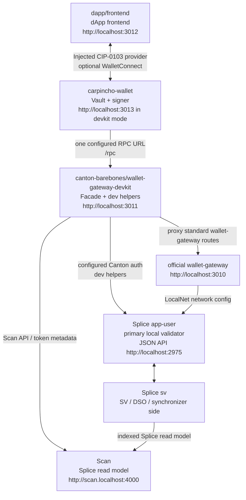

# Canton dApp Booster

Local Canton Network stack for wallet-first dApp experiments.



`canton:up` activates the official Splice LocalNet `sv` and `app-user` Docker
profiles, then starts the wallet-gateway-devkit facade. It does not start Keycloak or OIDC.
The app-provider UI containers are not started; a local compose override
disables their Nginx routes. The official shared Canton/Splice containers still
expose app-provider backend ports because the bundle bakes that config in.
Splice, wallet-gateway, and wallet-gateway-devkit share the `canton-barebones` Docker Compose project,
so Docker groups the full local stack together.
`app-user` is Splice's technical name for the primary local validator; it is not
the Carpincho user.

## Installation

Prerequisites:

- Node.js 24
- npm `>=7`
- Docker with about 8 GB memory available
- `dpm` on `PATH` (DAML SDK 3.4.11), required for building DARs

Install workspace dependencies:

```bash
npm install
```

Local service env files live under `canton-barebones/env/`:

| File                             | Owner                             |
| -------------------------------- | --------------------------------- |
| `env/.env.splice`                | Splice LocalNet download/profiles |
| `env/.env.wallet-gateway`        | public wallet-gateway port        |
| `env/.env.wallet-gateway-devkit` | devkit endpoints and auth         |

The official wallet-gateway also reads
`canton-barebones/config/wallet-gateway/config.json` because that package
expects a JSON config file. The compose file pins that path by default.

The real service env files are ignored because they can contain secrets. Start
from the service examples:

```bash
cp canton-barebones/env/examples/.env.splice.example canton-barebones/env/.env.splice
cp canton-barebones/env/examples/.env.wallet-gateway.example canton-barebones/env/.env.wallet-gateway
cp canton-barebones/env/examples/.env.wallet-gateway-devkit.example canton-barebones/env/.env.wallet-gateway-devkit
```

Carpincho only needs one RPC URL.

Auth configuration:

| Name                                 | What It Is                          | Who Uses It           |
| ------------------------------------ | ----------------------------------- | --------------------- |
| `AUTH_MODE=self-signed`              | local JWT signed with `AUTH_SECRET` | wallet-gateway-devkit |
| `AUTH_MODE=oauth-client-credentials` | OAuth client credentials flow       | wallet-gateway-devkit |
| `AUTH_MODE=static-token`             | externally obtained bearer token    | wallet-gateway-devkit |

Optional WalletConnect fallback:

```bash
cp carpincho-wallet/.env.local.example carpincho-wallet/.env.local
cp dapp/frontend/.env.local.example dapp/frontend/.env.local
```

Set `VITE_WC_PROJECT_ID` in both files only if you use WalletConnect.

## Quick Start

Start the stack:

```bash
npm run canton:up
```

`canton:up` defaults to `--splice wallet-gateway-devkit`. Pass one gateway mode
when you need to switch the public gateway behavior:

```bash
npm run canton:up -- wallet-gateway          # Splice + official wallet-gateway
npm run canton:up -- wallet-gateway-devkit   # Splice + wallet-gateway + devkit facade
npm run canton:up -- --help                  # show supported flags
```

When pointing the gateway layer at an external Splice stack, edit
`canton-barebones/env/.env.wallet-gateway-devkit` and start without LocalNet:

```bash
npm run canton:up -- --no-splice wallet-gateway-devkit
```

The official wallet-gateway is always public on `http://localhost:3010`.
Devkit mode also exposes wallet-gateway-devkit on `http://localhost:3011`.
Carpincho should point at `http://localhost:3011/rpc` when you want the
development helper RPCs. Devkit mode owns the Canton, Scan, validator, and
registry URLs behind service configuration.

Build the sample DAR when you need the package artifact:

```bash
cd dapp/daml
dpm build
```

Verify wallet-gateway-devkit:

```bash
curl -fsS http://localhost:3011/health
```

Start Carpincho and the dApp. Carpincho still defaults to `3011`; until that
project moves, run it on another dev port when wallet-gateway-devkit is up:

```bash
npm --prefix carpincho-wallet run dev -- --host localhost --port 3013 --strictPort
npm run app:dev
```

Open the dApp:

```text
http://localhost:3012
```

In the frontend:

1. Keep `canton:localnet` in settings.
2. Click `Connect with Carpincho`.
3. Approve the request in Carpincho.

## Extension

Build the extension:

```bash
npm run carpincho:build:extension
```

Load `carpincho-wallet/dist-extension` from `chrome://extensions` with
Developer mode enabled.

## Services And Ports

| Service                   | What It Is                                                 | URL / Port                                                                                         | Who Uses It                          |
| ------------------------- | ---------------------------------------------------------- | -------------------------------------------------------------------------------------------------- | ------------------------------------ |
| wallet-gateway            | Official wallet-gateway                                    | `http://localhost:3010`                                                                            | direct wallet-gateway clients/devkit |
| wallet-gateway-devkit     | Public facade for official wallet-gateway plus dev helpers | `http://localhost:3011`                                                                            | Carpincho via `/rpc`, tools          |
| Carpincho wallet          | Browser wallet UI/provider                                 | `http://localhost:3013` during devkit mode                                                         | user/dApp                            |
| dApp frontend             | Example dApp                                               | `http://localhost:3012`                                                                            | user                                 |
| app-user Wallet UI        | Official Splice wallet UI for app-user                     | `http://wallet.localhost:2000`                                                                     | optional/manual                      |
| app-user Ledger API       | gRPC Ledger API                                            | `grpc://localhost:2901`                                                                            | SDK/tools                            |
| app-user Admin API        | gRPC Admin API                                             | `grpc://localhost:2902`                                                                            | wallet-gateway-devkit/tools          |
| app-user Validator API    | Splice validator readiness/API                             | `http://localhost:2903`                                                                            | health/tools                         |
| app-user JSON API         | JSON Ledger API                                            | `http://localhost:2975`                                                                            | wallet-gateway-devkit/tools          |
| app-user Validator proxy  | wallet-sdk validator route                                 | `http://localhost:2000/api/validator`                                                              | wallet-gateway-devkit/tools          |
| app-provider backend APIs | Official bundle backend wiring, unused here                | `grpc://localhost:3901`, `grpc://localhost:3902`, `http://localhost:3903`, `http://localhost:3975` | not used                             |
| app-provider UI port      | Nginx port exposed by the bundle; routes disabled here     | `http://localhost:3000`                                                                            | not used                             |
| Scan UI                   | Splice explorer/read model UI                              | `http://scan.localhost:4000`                                                                       | optional/manual                      |
| Scan API                  | Splice indexed API                                         | `http://scan.localhost:4000/api/scan`                                                              | wallet-gateway-devkit/tools          |
| Amulet Registry           | token metadata via scan proxy                              | `http://localhost:2000/api/validator/v0/scan-proxy`                                                | wallet-gateway-devkit/tools          |
| SV UI                     | Super Validator operations UI                              | `http://sv.localhost:4000`                                                                         | optional/manual                      |
| sv Ledger/Admin/JSON APIs | Official SV participant APIs                               | `grpc://localhost:4901`, `grpc://localhost:4902`, `http://localhost:4975`                          | Splice internals/tools               |
| sv Validator API          | SV readiness/admin surface                                 | `http://localhost:4903`                                                                            | health checks                        |
| PostgreSQL                | Splice LocalNet DB                                         | `localhost:5432`                                                                                   | LocalNet containers/tools            |

If `wallet.localhost`, `scan.localhost`, or `sv.localhost` do not resolve, add:

```text
127.0.0.1 wallet.localhost scan.localhost sv.localhost
```

## Releasing

The root `package.json` `version` is the single source of truth for the release. Publishing a GitHub Release builds and publishes the artifacts.

1. Bump the version and tag it from the repo root:

   ```bash
   npm version <x.y.z>
   ```

   This updates the root `package.json`, commits, and creates the `v<x.y.z>` tag.

2. Push the commit and tag:

   ```bash
   git push --follow-tags
   ```

3. Publish a GitHub Release for that tag (the GitHub UI, or `gh release create v<x.y.z>`).
