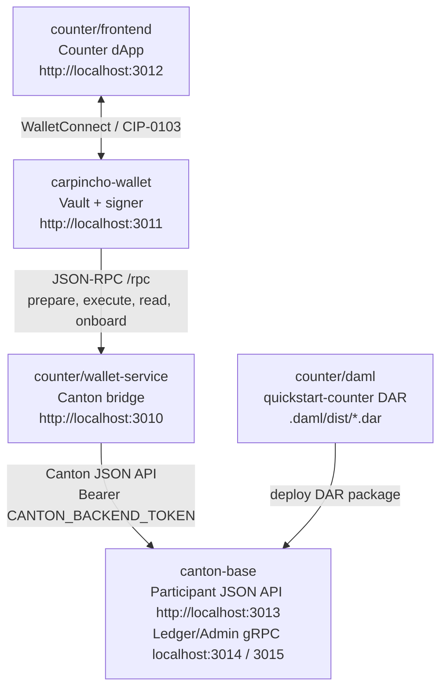

# Canton Counter Scaffold

Minimal local stack:



The frontend knows the Counter DAML signature and talks to Carpincho through WalletConnect. Carpincho owns the local signing key and uses the wallet service to prepare, read, and execute against the Canton participant.

## Quick Start

Two scripted entry points cover the common cases. They're aliases over §1 to §6 below; reach for them first and fall back to the manual sequence if you need to tweak a single step.

| Command | What it brings up | Host requirements |
| --- | --- | --- |
| `npm run dev:full` | Canton (Docker) -> DAR build + deploy -> wallet-service -> carpincho-wallet -> counter frontend, idempotently. Re-running skips already-done steps. | Docker installed (on macOS the script auto-launches Docker Desktop and waits for the daemon; on Linux the daemon must already be running), `dpm` on `$PATH`, `VITE_WC_PROJECT_ID` set in `carpincho-wallet/.env.local` and `counter/frontend/.env.local`. The script auto-copies `counter/wallet-service/.env.example` to `.env` if missing and mints `CANTON_BACKEND_TOKEN` when empty. |
| `npm run dev:wallet-mock` | Wallet-service in mock mode (no Canton, no Docker) + carpincho-wallet. The mock returns canned, well-formed responses for every RPC method the wallet calls (exercises `Add account`, `prepare`, `execute`, `read`, `status` end-to-end). | Node 24 and `VITE_WC_PROJECT_ID` in `carpincho-wallet/.env.local`. Nothing else. |

Both scripts prefix logs by component and shut every dev server down cleanly on a single `Ctrl-C`. `dev:full` leaves the Canton container running afterwards; stop it with `npm run canton:down`.

Daily wallet work uses `dev:wallet-mock`. Reach for `dev:full` when you need the real Canton round-trip (DAR-touching changes, end-to-end integration, debugging the participant boundary).

The manual §1 to §6 sequence remains the canonical reference. The scripts call the same `canton:*`, `counter:*`, `wallet-service:dev`, `wallet:dev`, and `app:dev` targets you'd run by hand.

## 0. One-Time Config

These are the prerequisites for `dev:full` and for the manual §1 to §6 path.

`dev:wallet-mock` only needs the carpincho-wallet `VITE_WC_PROJECT_ID` step below; it skips Docker, the DAML SDK, the wallet-service `.env`, and the Canton token.

WalletConnect needs a Reown project id in both browser apps:

```bash
cd carpincho-wallet
cp .env.local.example .env.local
# edit .env.local: VITE_WC_PROJECT_ID=...

cd ../counter/frontend
cp .env.local.example .env.local
# edit .env.local with the same VITE_WC_PROJECT_ID
```

The wallet-service also needs a local Canton backend token. This token is a
development JWT for the `wallet-service` user, used by `counter/wallet-service`
to authenticate its server-side requests to the local Canton JSON API at
`http://localhost:3013`. It is not a token asset and does not mint funds.

```bash
cp counter/wallet-service/.env.example counter/wallet-service/.env
npm run --silent canton:token
```

Copy the printed JWT into `counter/wallet-service/.env`:

```env
CANTON_BACKEND_TOKEN=<printed JWT>
```

The Canton participant verifies this JWT using the local HS256 auth settings in
`canton-base/.env`. The token is used only when the wallet-service calls the
Canton JSON API to create external parties, read active contracts, prepare
transactions, and submit signed prepared transactions. Health and service-info
endpoints can still respond without it, so missing token setup usually shows up
later when adding an account or executing a command.

The Canton network, Carpincho URL, and wallet-service URL are configured from the app UIs, not from env files. The defaults are:

- Canton network: `canton:local`
- Wallet-service RPC URL in Carpincho: `http://localhost:3010/rpc`
- Carpincho URL in frontend: `http://localhost:3011`

Local ports are intentionally assigned in the `3010+` range:

| Component                   | URL / Port              |
| --------------------------- | ----------------------- |
| Counter wallet service      | `http://localhost:3010` |
| Carpincho wallet            | `http://localhost:3011` |
| Counter frontend            | `http://localhost:3012` |
| Canton JSON API             | `http://localhost:3013` |
| Canton Ledger API           | `grpc://localhost:3014` |
| Canton Admin API            | `grpc://localhost:3015` |
| Canton health               | `http://localhost:3016` |
| Canton sequencer public API | `localhost:3017`        |
| Canton Postgres             | `localhost:3018`        |

The same ports back the [Quick Start](#quick-start) scripts: `dev:full` exposes the whole table, `dev:wallet-mock` only `:3010` (mock) and `:3011`.

## 1. Start Canton

```bash
npm run canton:up
npm run canton:health
```

Useful endpoints:

- JSON API: `http://localhost:3013`
- Ledger API: `grpc://localhost:3014`
- Admin API: `grpc://localhost:3015`
- Health: `http://localhost:3016`

## 2. Compile Counter

```bash
npm run counter:build-dar
```

Expected DAR:

```text
.daml/dist/quickstart-counter-0.0.1.dar
```

## 3. Deploy the DAR

```bash
npm run counter:deploy-dar
```

## 4. Start Counter Wallet Service

```bash
npm --prefix counter/wallet-service install
npm run wallet-service:dev
```

Checks:

```bash
curl http://localhost:3010/health
curl http://localhost:3010/
curl -s http://localhost:3010/rpc \
  -H 'content-type: application/json' \
  -d '{"jsonrpc":"2.0","id":1,"method":"status"}'
```

## 5. Start Carpincho Wallet

```bash
npm --prefix carpincho-wallet install
npm run wallet:dev
```

Open:

```text
http://localhost:3011
```

In Carpincho:

1. Create/unlock the vault.
2. In `Connection settings`, keep `http://localhost:3010/rpc` and `canton:local`.
3. Add an account. Carpincho generates an ed25519 keypair and asks the wallet-service to create the Canton external party.

## 6. Start the Counter App

```bash
npm --prefix counter/frontend install
npm run app:dev
```

Open:

```text
http://localhost:3012
```

In the frontend:

1. Keep `canton:local` and `http://localhost:3011` in settings.
2. Click `Connect with Carpincho` (the injected provider; preferred) or `Connect with WC` (WalletConnect; opt-in fallback).
3. Approve the request in Carpincho.
4. Create a counter or refresh visible counters.

## Normal Flow

```text
frontend (counter dApp)
  -> window.canton injection (preferred) | WalletConnect (opt-in)
  -> carpincho-wallet
  -> counter/wallet-service /rpc (dapp-api projection over JSON-RPC)
  -> canton-base participant
```

The dApp talks to Carpincho through the canonical CIP-0103 surface defined in
[`counter/wallet-service/api-specs/openrpc-dapp-api.json`](counter/wallet-service/api-specs/openrpc-dapp-api.json).
Carpincho's injected provider is the preferred path; WalletConnect remains an
opt-in fallback.

Wallet → page events (`accountsChanged`, `txChanged`, `connected`,
`statusChanged`) ride a small extension to the canonical SPLICE_WALLET
postMessage envelope — see
[`carpincho-wallet/README.md`](carpincho-wallet/README.md) for the wire diagram.

`npm run dev:full` (see [Quick Start](#quick-start)) drives this loop end-to-end. `npm run dev:wallet-mock` replaces `counter/wallet-service → canton-base` with a canned in-process responder so the wallet stays exercisable without Docker or a participant.

## End-to-end tests

A standalone Playwright suite lives under [`e2e/`](e2e/). It walks the full
dApp ↔ wallet ↔ wallet-service stack against the running dev servers:

```bash
npm run dev:full                       # in one terminal
npm --prefix carpincho-wallet run build:extension   # one-shot if dist-extension is stale
npm run e2e                            # in another terminal
```

12 tests cover smoke, spec conformance for `/rpc`, the `signMessage`
round-trip, the `accountsChanged` propagation, and the `txChanged` lifecycle.
See [`e2e/README.md`](e2e/README.md) for what's exercised and the
black-box convention.
