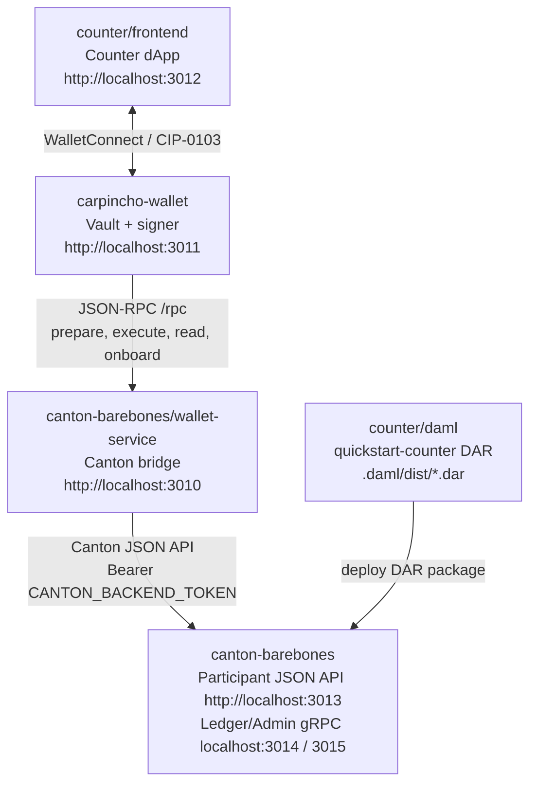

# Canton Counter Scaffold

Minimal local stack:



The frontend knows the Counter DAML signature and talks to Carpincho through WalletConnect. Carpincho owns the local signing key and uses the wallet service to prepare, read, and execute against the Canton participant.

## Quick Start

Run the packages in this order for the local Counter flow.

## canton-barebones

Configure envs:

```bash
cp canton-barebones/.env.example canton-barebones/.env
```

Start Canton:

```bash
npm run canton:up
npm run canton:health
```

## deploy dars

Build:

```bash
npm run build-dar -- counter/daml
```

Make sure Canton is running:

```bash
npm run canton:health
```

Deploy DAR:

```bash
npm run deploy-dar -- counter/daml/.daml/dist/quickstart-counter-0.0.1.dar
```

Use the same format for any other DAML project and DAR:

```bash
npm run build-dar -- <path/to/daml/project>
npm run deploy-dar -- <path/to/file.dar>
```

`canton:health` must return OK before deploying; otherwise the DAR upload can fail.

## wallet service

Already started by `npm run canton:up`. Verify with:

```bash
npm run wallet-service:health
```

The service self-mints its Canton JWT from `CANTON_AUTH_AUDIENCE` / `CANTON_AUTH_SECRET` / `CANTON_BACKEND_USER_ID` in `canton-barebones/.env`, so there is no token copy-paste step.

For host-side iteration (mock mode, no Docker required):

```bash
WALLET_SERVICE_MOCK=1 npm run wallet-service:dev
```

## wallet

### Install the extension from the Chrome Web Store

WIP. The extension is not deployed there yet.

### Use the extension from source

Build the extension:

```bash
npm --prefix carpincho-wallet install
npm run carpincho:build:extension
```

The build output is:

```text
carpincho-wallet/dist-extension
```

Then load it in Chrome with the shared steps below.

### Use the extension from GitHub release source

WIP. Release artifacts are not available yet.

After downloading and unpacking a release artifact, load it in Chrome with the shared steps below.

### Load an unpacked extension in Chrome

1. Open `chrome://extensions/`.
2. Enable `Developer mode`.
3. Click `Load unpacked`.
4. Select the unpacked extension folder (`carpincho-wallet/dist-extension` for a source build).

## dapp

Install the local connect kit first so Vite can resolve its peer/dev dependencies.

```bash
npm --prefix canton-connect-kit install
npm --prefix counter/frontend install
npm run app:dev
```

Open:

```text
http://localhost:3012
```

In the frontend:

1. Keep `canton:local` in settings.
2. Click `Connect with Carpincho`.
3. Approve the request in Carpincho.

### Optional: WalletConnect connect path

The Carpincho extension path above works out of the box. The `Connect with WalletConnect` button is also available, but it requires a Reown project id. Without it, connecting via WalletConnect throws.

Get a project id from https://cloud.reown.com, then set `VITE_WC_PROJECT_ID` in both:

```text
counter/frontend/.env.local
carpincho-wallet/.env.local
```

```bash
VITE_WC_PROJECT_ID=your_reown_project_id
```

## Ports

Local ports are intentionally assigned in the `3010+` range:

| Component                   | URL / Port              |
| --------------------------- | ----------------------- |
| Counter wallet service      | `http://localhost:3010` |
| Carpincho wallet            | `http://localhost:3011` |
| Counter frontend            | `http://localhost:3012` |
| Canton JSON API             | `http://localhost:3013` |
| Canton Ledger API           | `grpc://localhost:3014` |
| Canton Admin API            | `grpc://localhost:3015` |
| Canton health               | `http://localhost:3016` |
| Canton sequencer public API | `localhost:3017`        |
| Canton Postgres             | `localhost:3018`        |
