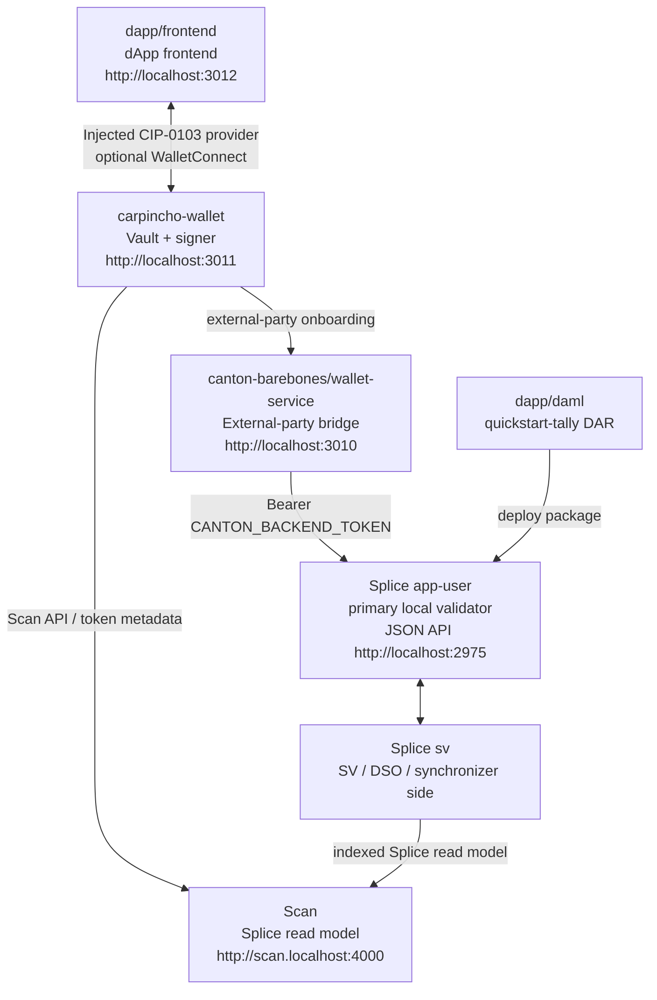

# Canton dApp Booster

Local Canton Network stack for wallet-first dApp experiments.



`canton:up` activates the official Splice LocalNet `sv` and `app-user` Docker
profiles, then starts wallet-service. It does not start Keycloak or OIDC.
The app-provider UI containers are not started; a local compose override
disables their Nginx routes. The official shared Canton/Splice containers still
expose app-provider backend ports because the bundle bakes that config in.
Splice and wallet-service share the `canton-barebones` Docker Compose project,
so Docker groups the full local stack together.
`app-user` is Splice's technical name for the primary local validator; it is not
the Carpincho user.

## Installation

Prerequisites:

- Node.js 24
- npm `>=7`
- Docker with about 8 GB memory available
- `dpm` on `PATH` (DAML SDK 3.4.11), required for building DARs

Install workspace dependencies:

```bash
npm install
```

Create the local env file:

```bash
cp canton-barebones/.env.example canton-barebones/.env
```

Generate the backend token and paste the printed `CANTON_BACKEND_TOKEN=...`
line into `canton-barebones/.env`:

```bash
npm run canton:token -- ledger-api-user
```

Token configuration:

| Name | What It Is | Who Uses It |
| --- | --- | --- |
| `CANTON_AUTH_AUDIENCE` | JWT audience recipe value | token script |
| `CANTON_AUTH_SECRET` | local unsafe JWT signing secret | token script only |
| `CANTON_BACKEND_TOKEN` | generated JWT pasted into `.env` | wallet-service |
| Carpincho LocalNet token | generated JWT pasted into Carpincho settings | Carpincho |

The token script uses `ledger-api-user` as the default JWT subject. Generate
another token with the same script or reuse the backend token locally. Do not
copy `CANTON_AUTH_SECRET` into Carpincho.

Optional WalletConnect fallback:

```bash
cp carpincho-wallet/.env.local.example carpincho-wallet/.env.local
cp dapp/frontend/.env.local.example dapp/frontend/.env.local
```

Set `VITE_WC_PROJECT_ID` in both files only if you use WalletConnect.

## Quick Start

Start the stack:

```bash
npm run canton:up
npm run canton:health
```

Build and deploy the sample DAR:

```bash
npm run build-dar -- dapp/daml
npm run deploy-dar -- dapp/daml/.daml/dist/quickstart-tally-0.0.1.dar
```

Verify wallet-service:

```bash
npm run wallet-service:health
```

Start Carpincho and the dApp:

```bash
npm run wallet:dev
npm run app:dev
```

Open the dApp:

```text
http://localhost:3012
```

In the frontend:

1. Keep `canton:localnet` in settings.
2. Click `Connect with Carpincho`.
3. Approve the request in Carpincho.

## Extension

Build the extension:

```bash
npm run carpincho:build:extension
```

Load `carpincho-wallet/dist-extension` from `chrome://extensions` with
Developer mode enabled.

## Services And Ports

| Service | What It Is | URL / Port | Who Uses It |
| --- | --- | --- | --- |
| wallet-service | Carpincho bridge for external-party onboarding | `http://localhost:3010` | Carpincho |
| Carpincho wallet | Browser wallet UI/provider | `http://localhost:3011` | user/dApp |
| dApp frontend | Example dApp | `http://localhost:3012` | user |
| app-user Wallet UI | Official Splice wallet UI for app-user | `http://wallet.localhost:2000` | optional/manual |
| app-user Ledger API | gRPC Ledger API | `grpc://localhost:2901` | SDK/tools |
| app-user Admin API | gRPC Admin API | `grpc://localhost:2902` | wallet-service/tools |
| app-user Validator API | Splice validator readiness/API | `http://localhost:2903` | health/tools |
| app-user JSON API | JSON Ledger API | `http://localhost:2975` | wallet-service/tools |
| app-user Validator proxy | wallet-sdk validator route | `http://localhost:2000/api/validator` | Carpincho |
| app-provider backend APIs | Official bundle backend wiring, unused here | `grpc://localhost:3901`, `grpc://localhost:3902`, `http://localhost:3903`, `http://localhost:3975` | not used |
| app-provider UI port | Nginx port exposed by the bundle; routes disabled here | `http://localhost:3000` | not used |
| Scan UI | Splice explorer/read model UI | `http://scan.localhost:4000` | optional/manual |
| Scan API | Splice indexed API | `http://scan.localhost:4000/api/scan` | Carpincho/tools |
| Amulet Registry | token metadata via scan proxy | `http://localhost:2000/api/validator/v0/scan-proxy` | Carpincho/tools |
| SV UI | Super Validator operations UI | `http://sv.localhost:4000` | optional/manual |
| sv Ledger/Admin/JSON APIs | Official SV participant APIs | `grpc://localhost:4901`, `grpc://localhost:4902`, `http://localhost:4975` | Splice internals/tools |
| sv Validator API | SV readiness/admin surface | `http://localhost:4903` | health checks |
| PostgreSQL | Splice LocalNet DB | `localhost:5432` | LocalNet containers/tools |

If `wallet.localhost`, `scan.localhost`, or `sv.localhost` do not resolve, add:

```text
127.0.0.1 wallet.localhost scan.localhost sv.localhost
```
