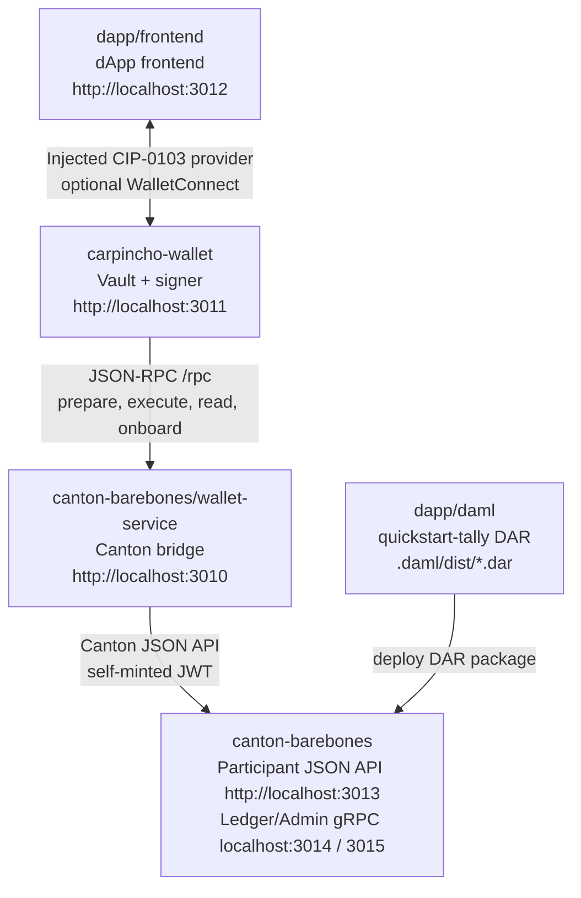

# Canton dApp Booster

Minimal local stack:



The dApp frontend knows the Tally DAML signature and talks to Carpincho through the injected CIP-0103 browser provider. Carpincho owns the local signing key and uses the wallet service to prepare, read, and execute against the Canton participant. WalletConnect remains available as an optional fallback path.

## Installation

Prerequisites:

- Node.js 24
- npm
- Docker
- `dpm` on `PATH` (DAML SDK 3.4.11), required for building DARs

### Recommended

```bash
npx dappbooster --canton
```

### Manual

```bash
npm install
```

### Environment files

#### Mandatory

```bash
cp canton-barebones/.env.example canton-barebones/.env
```

#### Optional

Only for the WalletConnect fallback. Copy each and set `VITE_WC_PROJECT_ID` (see the dApp frontend [WalletConnect setup](dapp/frontend/README.md#walletconnect-fallback)):

```bash
cp carpincho-wallet/.env.local.example carpincho-wallet/.env.local
cp dapp/frontend/.env.local.example dapp/frontend/.env.local
```

## Dev stack script

[`scripts/dev-stack.sh`](scripts/dev-stack.sh) automates the manual Quick Start below. Run it with no arguments for an interactive menu.

```bash
./scripts/dev-stack.sh
```

Or call an action directly:

```bash
./scripts/dev-stack.sh <action>
```

| Menu item | Action | What it does |
|-----------|--------|--------------|
| Install | `install` | Install and link every workspace from the repo root (`npm install`). |
| Docker up | `docker-up` | Launch Docker Desktop (macOS only). |
| Docker down | `docker-down` | Quit Docker Desktop (macOS only). |
| Stack up | `up` | Bring up containers, build + deploy the DAR, start the wallet and dApp dev servers, build the extension. |
| Stack down | `down` | Stop the dev servers and tear down the containers. |
| Wallet up | `mock-up` | Start the mocked wallet-service + Carpincho web app with no Docker. |
| Wallet down | `mock-down` | Stop the mocked wallet-service + Carpincho web app. |
| Build extension | `extension` | Build the Chrome extension and copy it to your desktop. |
| (CLI only) | `status` | Show running containers and listening ports. |

Notes:

- Docker lifecycle is managed separately from the stack: `up` and `down` assume Docker is already running and never start or quit it. Start/quit Docker with `docker-up` / `docker-down`, the Docker app, or your own CLI.
- `up` requires Docker running and `dpm` on `PATH` (for the DAR build).

## Quick Start (manual)

1. **Start Canton + wallet-service** ([`canton-barebones`](canton-barebones/README.md)):

   ```bash
   npm run canton:up
   npm run canton:health
   ```

2. **Build and deploy the Tally DAR** ([`dapp/daml`](dapp/daml/README.md) builds, [`canton-barebones`](canton-barebones/README.md#deploy-a-dar) deploys):

   ```bash
   npm run build-dar -- dapp/daml
   npm run deploy-dar -- dapp/daml/.daml/dist/quickstart-tally-0.0.1.dar
   ```

3. **Build and load the Carpincho extension** ([`carpincho-wallet`](carpincho-wallet/README.md#browser-extension)):

   ```bash
   npm run carpincho:build:extension
   ```

4. **Start the dApp frontend** ([`dapp/frontend`](dapp/frontend/README.md)):

   ```bash
   npm run app:dev
   ```

For host-side iteration without Docker, see the wallet-service [mock mode](canton-barebones/wallet-service/README.md#mock-mode). For the WalletConnect fallback, see the dApp frontend [WalletConnect setup](dapp/frontend/README.md#walletconnect-fallback).

## Ports

| Component                   | URL / Port              |
| --------------------------- | ----------------------- |
| Wallet service              | `http://localhost:3010` |
| Carpincho wallet            | `http://localhost:3011` |
| dApp frontend               | `http://localhost:3012` |
| Canton JSON API             | `http://localhost:3013` |
| Canton Ledger API           | `grpc://localhost:3014` |
| Canton Admin API            | `grpc://localhost:3015` |
| Canton health               | `http://localhost:3016` |
| Canton sequencer public API | `localhost:3017`        |
| Canton Postgres             | `localhost:3018`        |

## Releasing

The root `package.json` `version` is the single source of truth for the release. Publishing a GitHub Release builds and publishes the artifacts.

1. Bump the version and tag it from the repo root:

   ```bash
   npm version <x.y.z>
   ```

   This updates the root `package.json`, commits, and creates the `v<x.y.z>` tag.

2. Push the commit and tag:

   ```bash
   git push --follow-tags
   ```

3. Publish a GitHub Release for that tag (the GitHub UI, or `gh release create v<x.y.z>`).