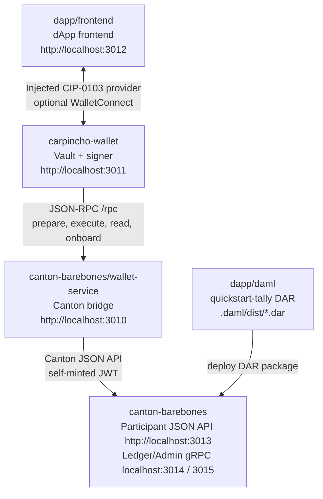

# Canton dApp Booster

Minimal local stack:



The dApp frontend knows the Tally DAML signature and talks to Carpincho through the injected CIP-0103 browser provider. Carpincho owns the local signing key and uses the wallet service to prepare, read, and execute against the Canton participant. WalletConnect remains available as an optional fallback path.

## Installation

Prerequisites:

- Node.js 24
- npm `>=7`
- Docker
- `dpm` on `PATH` (DAML SDK 3.4.11), required for building DARs

### Recommended: dappbooster installer

```bash
npx dappbooster --canton
```

### Manual

npm workspaces monorepo; one install from the repo root links every package:

```bash
npm install
```

### Environment files

#### Mandatory

```bash
cp canton-barebones/.env.example canton-barebones/.env
```

#### Optional

Only for the WalletConnect fallback. Copy each and set `VITE_WC_PROJECT_ID` (see [Optional: WalletConnect connect path](#optional-walletconnect-connect-path)):

```bash
cp carpincho-wallet/.env.local.example carpincho-wallet/.env.local
cp dapp/frontend/.env.local.example dapp/frontend/.env.local
```

## Dev stack script

[`scripts/dev-stack.sh`](scripts/dev-stack.sh) automates the manual Quick Start below. Run it with no arguments for an interactive menu (navigate with arrow keys or `j`/`k`, jump with number keys `1`-`9`, select with Enter, quit with `q`):

```bash
./scripts/dev-stack.sh
```

Or call an action directly:

```bash
./scripts/dev-stack.sh <action>
```

| Menu item | Action | What it does |
|-----------|--------|--------------|
| Install | `install` | Install and link every workspace from the repo root (`npm install`). |
| Docker up | `docker-up` | Launch Docker Desktop and wait for the daemon (macOS only). |
| Docker down | `docker-down` | Quit Docker Desktop (macOS only). |
| Stack up | `up` | Bring up containers, build + deploy the DAR, start the wallet (3011) and dApp (3012) dev servers, build the extension. |
| Stack down | `down` | Stop the dev servers and tear down the containers. |
| Wallet up | `mock-up` | Start the mocked wallet-service (3010) + Carpincho web app (3011) with no Docker. |
| Wallet down | `mock-down` | Stop the mocked wallet-service + Carpincho web app only. |
| Build extension | `extension` | Build the Chrome extension and copy it to `~/Desktop/dist-extension`. |
| (CLI only) | `status` | Show running containers and listening ports. |

Notes:

- Docker lifecycle is managed separately from the stack: `up` and `down` assume Docker is already running and never start or quit it. Start/quit Docker with `docker-up` / `docker-down`, the Docker app, or your own CLI.
- `up` requires Docker running and `dpm` on `PATH` (for the DAR build). It fails fast with a clear message if the daemon is not reachable.
- Background dev-server PIDs and logs live under `${TMPDIR:-/tmp}/cn-dev-stack/`.
- The two Docker actions are macOS only; on other platforms they warn and no-op, while every other action runs unchanged.

For the manual, step-by-step flow (and the underlying `npm` scripts the helper wraps), follow the rest of this document.

## Quick Start

Run the packages in this order for the local dApp flow.

## canton-barebones

Start Canton:

```bash
npm run canton:up
npm run canton:health
```

## deploy dars

Build:

```bash
npm run build-dar -- dapp/daml
```

Make sure Canton is running:

```bash
npm run canton:health
```

Deploy DAR:

```bash
npm run deploy-dar -- dapp/daml/.daml/dist/quickstart-tally-0.0.1.dar
```

Use the same format for any other DAML project and DAR:

```bash
npm run build-dar -- <path/to/daml/project>
npm run deploy-dar -- <path/to/file.dar>
```

`canton:health` must return OK before deploying; otherwise the DAR upload can fail.

## wallet service

Already started by `npm run canton:up`. Verify with:

```bash
npm run wallet-service:health
```

The service self-mints its Canton JWT from `CANTON_AUTH_AUDIENCE` / `CANTON_AUTH_SECRET` / `CANTON_ADMIN_USER_ID` in `canton-barebones/.env`, so there is no token copy-paste step.

For host-side iteration (mock mode, no Docker required):

```bash
WALLET_SERVICE_MOCK=1 npm run wallet-service:dev
```

## wallet

### Install the extension from the Chrome Web Store

WIP. The extension is not deployed there yet.

### Use the extension from source

Build the extension:

```bash
npm run carpincho:build:extension
```

The build output is:

```text
carpincho-wallet/dist-extension
```

Then load it in Chrome with the shared steps below.

### Use the extension from GitHub release source

WIP. Release artifacts are not available yet.

After downloading and unpacking a release artifact, load it in Chrome with the shared steps below.

### Load an unpacked extension in Chrome

1. Open `chrome://extensions/`.
2. Enable `Developer mode`.
3. Click `Load unpacked`.
4. Select the unpacked extension folder (`carpincho-wallet/dist-extension` for a source build).

## dapp

```bash
npm run app:dev
```

Open:

```text
http://localhost:3012
```

In the frontend:

1. Keep `canton:local` in settings.
2. Click `Connect with Carpincho`.
3. Approve the request in Carpincho.

### Optional: WalletConnect connect path

The Carpincho extension path above works through the injected CIP-0103 provider and does not require a Reown project id. The `Connect with WalletConnect` button is also available, but it requires a Reown project id. Without it, connecting via WalletConnect throws.

Get a project id from https://cloud.reown.com, then set `VITE_WC_PROJECT_ID` in both:

```text
dapp/frontend/.env.local
carpincho-wallet/.env.local
```

```bash
VITE_WC_PROJECT_ID=your_reown_project_id
```

## Ports

Local ports are intentionally assigned in the `3010+` range:

| Component                   | URL / Port              |
| --------------------------- | ----------------------- |
| Wallet service              | `http://localhost:3010` |
| Carpincho wallet            | `http://localhost:3011` |
| dApp frontend               | `http://localhost:3012` |
| Canton JSON API             | `http://localhost:3013` |
| Canton Ledger API           | `grpc://localhost:3014` |
| Canton Admin API            | `grpc://localhost:3015` |
| Canton health               | `http://localhost:3016` |
| Canton sequencer public API | `localhost:3017`        |
| Canton Postgres             | `localhost:3018`        |
