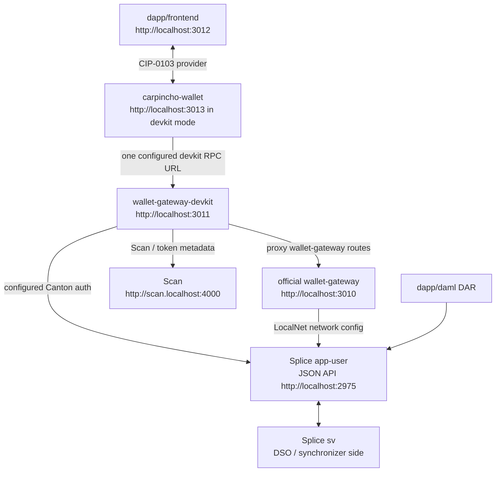

# Architecture Overview — Canton dApp Booster

## Tech Stack

| Scope | Stack | Responsibility |
| --- | --- | --- |
| `canton-barebones/` | Bash + Docker Compose + official Splice LocalNet bundle | Starts `sv + app-user`, health checks, auth helper, DAR upload |
| `canton-barebones/wallet-gateway-devkit/` | Node 24 + Express 5 + TypeScript + `@canton-network/wallet-sdk` | Facade over official wallet-gateway with dev RPC helpers for Carpincho |
| `carpincho-wallet/` | Vite 6 + React 18 + Tailwind v4 + Radix UI + WalletConnect + `@tanstack/react-query` + `@noble/ed25519` | CIP-0103 browser wallet, encrypted vault, signer, injected provider |
| `dapp/frontend/` | Vite + React + `@canton-network/dapp-sdk` | Example dApp that talks to Carpincho |
| `dapp/daml/` | DAML | `quickstart-tally` DAR |
| `dapp/e2e/` | Playwright + TypeScript | Black-box integration tests |
| `canton-connect-kit/` | TypeScript + React | Reusable wallet connection hooks |

## Data Flow



`app-user` is the primary local validator from the official Splice LocalNet
bundle. It is not a product user. `sv` provides the Super Validator / DSO side
needed by Splice and Canton Coin. The app-provider UI profile is not started;
its Nginx routes are disabled locally. The official shared Canton/Splice
containers still expose app-provider backend ports.

State boundaries:

- The dApp talks to Carpincho through the CIP-0103 provider surface.
- Carpincho owns user keys and signs locally.
- Carpincho stores one gateway RPC URL only; it does not store Canton, Scan, validator, or registry URLs.
- wallet-gateway-devkit holds Canton auth config for dev helpers and external-party onboarding.
- wallet-gateway-devkit owns Canton/Scan endpoint config and proxies standard wallet-gateway routes to the official wallet-gateway when it runs in devkit mode.
- Splice LocalNet owns the app-user participant/validator, Scan, SV, and CC infrastructure.
- Splice, wallet-gateway, and wallet-gateway-devkit share the `canton-barebones` Docker Compose project label, but the gateway layer uses its own compose file and Docker network.
- Carpincho should use generated bearer tokens for direct LocalNet endpoints; it should not copy `AUTH_SECRET` into the browser.

## Docker Composition

`canton-barebones/scripts/up.sh` composes the local stack in two phases.

Phase 1 starts the official Splice LocalNet bundle. The bundle is downloaded
from the `digital-asset/decentralized-canton-sync` GitHub release matching
`SPLICE_IMAGE_TAG`, extracted under
`~/.canton-dappbooster/splice-localnet`, and run from its official
`splice-node/docker-compose/localnet/compose.yaml`. Those services use released
images from `ghcr.io/digital-asset/decentralized-canton-sync/docker/...`.

Phase 2 starts the gateway layer from this repository's
`canton-barebones/docker-compose.yaml`.

| Layer | Compose Source | Services | Image Source | Docker Network |
| --- | --- | --- | --- | --- |
| Splice LocalNet | downloaded Splice bundle compose plus `config/splice/localnet-overrides.yaml` | `postgres`, `canton`, `splice`, `nginx`, Scan/SV/app-user web UIs | GHCR Splice images tagged by `SPLICE_IMAGE_TAG` | `localnet` |
| Official wallet-gateway | `canton-barebones/docker-compose.yaml` | `wallet-gateway` | `node:24-alpine` running `npm exec @canton-network/wallet-gateway-remote@1.4.0` | `canton-barebones_default` |
| Devkit facade | `canton-barebones/docker-compose.yaml` | `wallet-gateway-devkit` | local Docker build from `canton-barebones/wallet-gateway-devkit/Dockerfile` | `canton-barebones_default` |

Both compose invocations set the project name to `canton-barebones`, so Docker
groups the containers under the same compose project. They do not share one
network: Splice uses the official bundle's `localnet` network, while
wallet-gateway and wallet-gateway-devkit use this repository's
`canton-barebones_default` network.

Because the gateway layer is on a different Docker network, it reaches Splice
through host-published ports via `host.docker.internal`:

| From | To | URL |
| --- | --- | --- |
| wallet-gateway-devkit | app-user JSON API | `http://host.docker.internal:2975` |
| wallet-gateway-devkit | app-user Ledger API | `grpc://host.docker.internal:2901` |
| wallet-gateway-devkit | app-user Admin API | `grpc://host.docker.internal:2902` |
| wallet-gateway-devkit | app-user validator proxy | `http://host.docker.internal:2000/api/validator` |
| wallet-gateway-devkit | Scan API | `http://host.docker.internal:4000/api/scan` |

The official wallet-gateway is always public at `http://localhost:3010`.
Inside the gateway network, wallet-gateway-devkit also reaches it by service
name:

```text
wallet-gateway-devkit -> http://wallet-gateway:3030
```

The public caller path in devkit mode is:

```text
Carpincho -> http://localhost:3011/rpc
  -> wallet-gateway-devkit
     -> host.docker.internal:2975/2901/2902/2000/4000 for Canton and Scan helpers
     -> wallet-gateway:3030 for proxied standard wallet-gateway routes
```

The direct official gateway path is:

```text
client -> http://localhost:3010
  -> wallet-gateway
     -> host.docker.internal:2975 for JSON Ledger API
```

Runtime config is split by service:

| File | Owner |
| --- | --- |
| `canton-barebones/env/.env.splice` | Splice LocalNet bundle tag, cache path, compose project, profiles |
| `canton-barebones/env/.env.wallet-gateway` | official wallet-gateway public port |
| `canton-barebones/env/.env.wallet-gateway-devkit` | devkit ports, Canton/Scan URLs, provider metadata, auth, upstream wallet-gateway URL |
| `canton-barebones/config/wallet-gateway/config.json` | JSON config consumed by the official wallet-gateway package |

## Splice Profiles

The current LocalNet profile set lives in
`canton-barebones/env/.env.splice`:

```text
sv
app-user
```

`app-user` is the primary local validator used by wallet-gateway-devkit. The
app-provider profile is not enabled by the current scripts. Its backend ports
still appear because the official shared `canton` and `splice` containers mount
app-provider config, but the app-provider UI containers are not started and the
local Nginx override replaces the app-provider UI route with an empty template.

App-provider can be enabled, but it needs an explicit script/config change:
include the `app-provider` profile, stop overriding its Nginx template, update
health checks and docs, and decide whether wallet-gateway-devkit should still
target app-user or point at app-provider endpoints.

## Services And Ports

| Service | URL / Port | Purpose |
| --- | --- | --- |
| wallet-gateway | `http://localhost:3010` | official wallet-gateway |
| wallet-gateway-devkit | `http://localhost:3011` | public facade plus dev helpers |
| Carpincho wallet | `http://localhost:3013` during devkit mode | browser wallet UI/provider |
| dApp frontend | `http://localhost:3012` | example dApp |
| app-user Wallet UI | `http://wallet.localhost:2000` | optional official Splice wallet UI |
| app-user Ledger API | `grpc://localhost:2901` | SDK/tools |
| app-user Admin API | `grpc://localhost:2902` | wallet-gateway-devkit/tools |
| app-user Validator API | `http://localhost:2903` | health/tools |
| app-user JSON API | `http://localhost:2975` | wallet-gateway-devkit/tools |
| app-user Validator proxy | `http://localhost:2000/api/validator` | wallet-gateway-devkit/tools |
| app-provider backend APIs | `grpc://localhost:3901`, `grpc://localhost:3902`, `http://localhost:3903`, `http://localhost:3975` | official bundle wiring, unused |
| app-provider UI port | `http://localhost:3000` | exposed by Nginx, routes disabled |
| Scan UI | `http://scan.localhost:4000` | explorer/read model UI |
| Scan API | `http://scan.localhost:4000/api/scan` | wallet-gateway-devkit/tools |
| Amulet Registry | `http://localhost:2000/api/validator/v0/scan-proxy` | wallet-gateway-devkit token metadata |
| SV UI | `http://sv.localhost:4000` | Super Validator operations UI |
| sv Ledger/Admin/JSON APIs | `grpc://localhost:4901`, `grpc://localhost:4902`, `http://localhost:4975` | Splice internals/tools |
| sv Validator API | `http://localhost:4903` | health checks |
| PostgreSQL | `localhost:5432` | Splice LocalNet database |

## Config And Auth

There is no environment selector in code. A developer edits the service env
files directly, or copies a reference file from `canton-barebones/env/examples/`.

wallet-gateway-devkit supports three auth modes through
`canton-barebones/env/.env.wallet-gateway-devkit`:

| Mode | Required values | When to use |
| --- | --- | --- |
| `self-signed` | `AUTH_SECRET`, optional `AUTH_AUDIENCE`, `AUTH_SUBJECT` | LocalNet |
| `oauth-client-credentials` | `AUTH_TOKEN_URL`, `AUTH_CLIENT_ID`, `AUTH_CLIENT_SECRET`, optional `AUTH_SCOPE` | DevNet/TestNet environments that issue JWTs through OAuth |
| `static-token` | `AUTH_TOKEN` | Operators who already have a valid JWT |

`AUTH_SECRET`, OAuth client secrets, and bearer tokens stay server-side.
Carpincho only points at one gateway URL; it does not receive Canton, Scan,
validator, registry, OAuth, or signing-secret configuration from this repo.

## Orchestration

| Command | What it does |
| --- | --- |
| `npm run canton:up` | download/cache Splice bundle, start `sv + app-user` UI profiles, then wallet-gateway-devkit mode |
| `npm run canton:up -- wallet-gateway` | start Splice plus the official wallet-gateway as the public gateway |
| `npm run canton:up -- wallet-gateway-devkit` | start Splice plus wallet-gateway behind the public devkit facade |
| `npm run canton:up -- --no-splice wallet-gateway-devkit` | start only the gateway layer against externally configured Splice endpoints |
| `npm run canton:down` | stop the selected gateway and Splice LocalNet, preserving volumes |
| `npm run canton:health` | check app-user, sv, Scan, wallet UI, and the selected gateway |
| `npm --prefix canton-barebones run token -- ledger-api-user` | generate a LocalNet dev JWT for manual/static-token use |
| `./canton-barebones/scripts/deploy-dar.sh <dar>` | upload DAR to app-user JSON API |
| `npm run app:dev` | start the dApp frontend |

For the bring-up sequence, follow [`README.md`](README.md).
