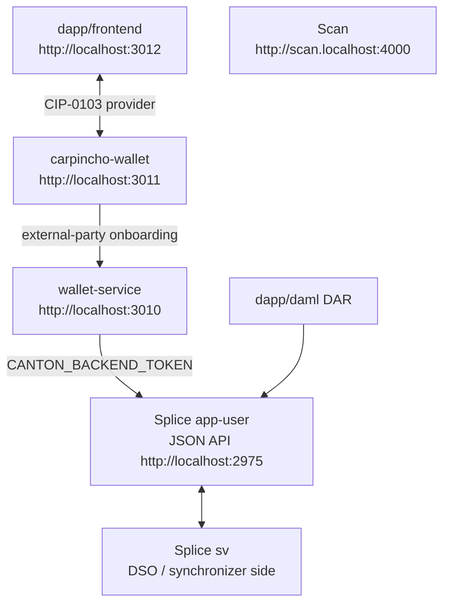

# Architecture Overview — Canton dApp Booster

## Tech Stack

| --- | --- | --- |
| `canton-barebones/` | Bash + Docker Compose + official Splice LocalNet bundle | Starts `sv + app-user`, health checks, token helper, DAR upload |
| `canton-barebones/wallet-service/` | Node 24 + Express 5 + TypeScript + `@canton-network/wallet-sdk` | Bridge Carpincho uses for external-party onboarding and participant JSON API calls |
| `carpincho-wallet/` | Vite 6 + React 18 + Tailwind v4 + Radix UI + WalletConnect + `@noble/ed25519` | CIP-0103 browser wallet, encrypted vault, signer, injected provider |
| `dapp/frontend/` | Vite + React + `@canton-network/dapp-sdk` | Example dApp that talks to Carpincho |
| `dapp/daml/` | DAML | `quickstart-tally` DAR |
| `dapp/e2e/` | Playwright + TypeScript | Black-box integration tests |
| `canton-connect-kit/` | TypeScript + React | Reusable wallet connection hooks |

## Data Flow

`app-user` is the primary local validator from the official Splice LocalNet
bundle. It is not a product user. `sv` provides the Super Validator / DSO side
needed by Splice and Canton Coin. The app-provider UI profile is not started;
its Nginx routes are disabled locally. The official shared Canton/Splice
containers still expose app-provider backend ports.

State boundaries:

- The dApp talks to Carpincho through the CIP-0103 provider surface.
- Carpincho owns user keys and signs locally.
- wallet-service holds `CANTON_BACKEND_TOKEN` and remains the external-party onboarding bridge.
- Splice LocalNet owns the app-user participant/validator, Scan, SV, and CC infrastructure.
- Splice and wallet-service share the `canton-barebones` Docker Compose project.
- Carpincho should use generated bearer tokens for direct LocalNet endpoints; it should not copy `CANTON_AUTH_SECRET` into the browser.

## Services And Ports

| Service | URL / Port | Purpose |
| --- | --- | --- |
| wallet-service | `http://localhost:3010` | Carpincho bridge for onboarding and JSON API calls |
| Carpincho wallet | `http://localhost:3011` | browser wallet UI/provider |
| dApp frontend | `http://localhost:3012` | example dApp |
| app-user Wallet UI | `http://wallet.localhost:2000` | optional official Splice wallet UI |
| app-user Ledger API | `grpc://localhost:2901` | SDK/tools |
| app-user Admin API | `grpc://localhost:2902` | wallet-service/tools |
| app-user Validator API | `http://localhost:2903` | health/tools |
| app-user JSON API | `http://localhost:2975` | wallet-service/tools |
| app-user Validator proxy | `http://localhost:2000/api/validator` | Carpincho/tools |
| app-provider backend APIs | `grpc://localhost:3901`, `grpc://localhost:3902`, `http://localhost:3903`, `http://localhost:3975` | official bundle wiring, unused |
| app-provider UI port | `http://localhost:3000` | exposed by Nginx, routes disabled |
| Scan UI | `http://scan.localhost:4000` | explorer/read model UI |
| Scan API | `http://scan.localhost:4000/api/scan` | Carpincho/tools |
| Amulet Registry | `http://localhost:2000/api/validator/v0/scan-proxy` | token metadata |
| SV UI | `http://sv.localhost:4000` | Super Validator operations UI |
| sv Ledger/Admin/JSON APIs | `grpc://localhost:4901`, `grpc://localhost:4902`, `http://localhost:4975` | Splice internals/tools |
| sv Validator API | `http://localhost:4903` | health checks |
| PostgreSQL | `localhost:5432` | Splice LocalNet database |

## Auth

| Variable | Owner | Purpose |
| --- | --- | --- |
| `CANTON_AUTH_AUDIENCE` | `canton-barebones/.env` | JWT audience recipe used by `npm run canton:token` |
| `CANTON_AUTH_SECRET` | `canton-barebones/.env` | unsafe local signing secret used only by the token script |
| `CANTON_BACKEND_TOKEN` | `canton-barebones/.env` | generated JWT consumed by wallet-service |

`CANTON_AUTH_AUDIENCE` plus `CANTON_AUTH_SECRET` is the local signing recipe.
`CANTON_BACKEND_TOKEN` is the generated token. The token script defaults the
JWT subject to `ledger-api-user`; Carpincho can use a separate token generated
with the same script, configured manually in its LocalNet settings.

## Orchestration

| Command | What it does |
| --- | --- |
| `npm run canton:up` | download/cache Splice bundle, start `sv + app-user` UI profiles, then wallet-service |
| `npm run canton:down` | stop wallet-service and Splice LocalNet, preserving volumes |
| `npm run canton:health` | check app-user, sv, Scan, wallet UI, and wallet-service |
| `npm run canton:token -- ledger-api-user` | generate a LocalNet dev JWT |
| `npm run deploy-dar -- <dar>` | upload DAR to app-user JSON API |
| `npm run wallet:dev` | start Carpincho web UI |
| `npm run app:dev` | start the dApp frontend |

For the bring-up sequence, follow [`README.md`](README.md).
