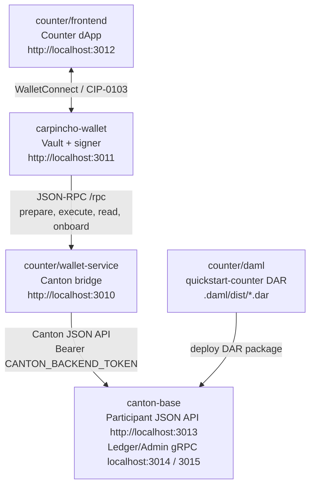

# Architecture Overview — Canton Counter Scaffold

<!-- Monorepo-level architecture. Captures the shape of the whole stack:
     subprojects, ports, data flow between components, environment variables.
     For wallet-internal architecture (vault, CIP-0103 provider, extension
     scripts), see carpincho-wallet/architecture.md. -->

## Tech Stack (per subproject)

| Subproject | Stack | Purpose |
|------------|-------|---------|
| `canton-base/` | Docker Compose + Bash + Node scripts | Local Canton participant node, Postgres, mint-token helper, DAR deploy script, health-check |
| `counter/daml/` | DAML (`dpm` build) | `quickstart-counter` model — DAR consumed by Canton |
| `counter/wallet-service/` | Node 24 + Express 5 + TypeScript + `@canton-network/wallet-sdk` | JSON-RPC bridge between the wallet and the Canton participant JSON API. Supports a `WALLET_SERVICE_MOCK=1` mode (`src/mock.ts`) that short-circuits the dispatcher with canned responses. |
| `carpincho-wallet/` | Vite 6 + React 18 + Tailwind v4 + Radix UI + Biome + WalletConnect Sign Client 2.x + `@noble/ed25519` | CIP-0103 wallet (web + Chrome extension), encrypted local vault, signing |
| `counter/frontend/` | Vite + React + `@canton-network/dapp-sdk` + ESLint | Counter dApp UI that talks to the wallet over WalletConnect |

## Project Structure

```
.
├── .claude/
│   ├── settings.local.json        (gitignored)
│   └── skills/{create-pr,issue}   SDLC agent skills (used by /sdlc:* slash commands)
├── .github/
│   ├── ISSUE_TEMPLATE/            bug / feature / epic / spike templates
│   └── PULL_REQUEST_TEMPLATE.md
├── .husky/                        commit-msg, pre-commit, pre-push hooks
├── canton-base/                   Local Canton participant + Postgres
├── carpincho-wallet/              CIP-0103 wallet (web + Chrome extension)
├── counter/
│   ├── daml/                      quickstart-counter DAML model
│   ├── frontend/                  Counter dApp UI
│   └── wallet-service/            JSON-RPC bridge to Canton
├── CLAUDE.md                      Agent rules — monorepo-wide
├── AGENTS.md                      Pointer to CLAUDE.md for non-Claude agents
├── architecture.md                THIS FILE
├── README.md                      Bring-up runbook for the local stack
├── commitlint.config.js           Conventional Commit enforcement
├── .lintstagedrc.mjs              Per-subproject lint dispatch
├── .nvmrc                         Node 24
└── package.json                   Root orchestration scripts (npm --prefix <dir>)
```

## Data Flow

The whole local stack is one signing loop. The Counter frontend speaks to Carpincho over WalletConnect; Carpincho signs locally and routes the signed transaction through the wallet-service JSON-RPC bridge, which calls the Canton participant's JSON API; the participant materialises the change against the deployed `quickstart-counter` DAR.



State boundaries:

- `counter/frontend` never touches the participant directly. It only knows about Carpincho (over WalletConnect) and the Counter DAML signature.
- `carpincho-wallet` holds all signing keys (PBKDF2 + AES-GCM vault, Ed25519). It never talks to Canton directly; it goes through `counter/wallet-service`.
- `counter/wallet-service` is the only component holding the Canton bearer token. It validates and forwards JSON-RPC calls onto the participant's JSON API.
- `canton-base` is the participant. Its bearer-token validation pins the trust boundary.

## Service Ports

Local ports are intentionally assigned in the `3010+` range so they collide with nothing else on a dev machine.

| Component | URL / Port |
|-----------|------------|
| Counter wallet service | `http://localhost:3010` |
| Carpincho wallet | `http://localhost:3011` |
| Counter frontend | `http://localhost:3012` |
| Canton JSON API | `http://localhost:3013` |
| Canton Ledger API | `grpc://localhost:3014` |
| Canton Admin API | `grpc://localhost:3015` |
| Canton health | `http://localhost:3016` |
| Canton sequencer public API | `localhost:3017` |
| Canton Postgres | `localhost:3018` |

## Environment Variables

| Variable | Owner | Purpose |
|----------|-------|---------|
| `VITE_WC_PROJECT_ID` | `carpincho-wallet/.env.local`, `counter/frontend/.env.local` | WalletConnect / Reown project ID. Same value in both subprojects. |
| `CANTON_BACKEND_TOKEN` | `counter/wallet-service/.env` | Development JWT for the Canton `wallet-service` user. Used only when the wallet-service calls the Canton JSON API. Mint with `npm run canton:token`. |

Runtime-only configuration that varies between sessions (RPC URL, Canton network name, Carpincho URL) is stored in `localStorage` inside the wallet and the frontend, configured from each UI — not from env files.

## Orchestration Scripts

Driven from root `package.json`:

| Command | What it does |
|---------|--------------|
| `npm run canton:up` / `canton:down` | docker compose up/down inside `canton-base/` |
| `npm run canton:health` | Hit the participant health endpoint at `:3016` |
| `npm run canton:token` | Mint a dev JWT for the wallet-service user |
| `npm run build-dar -- <daml-project>` | DAML build via `dpm` inside the provided DAML project directory |
| `npm run deploy-dar -- <dar>` | Deploy the provided DAR to the local participant |
| `npm --prefix counter/wallet-service run dev` | Start the wallet-service on `:3010` (tsx watch) |
| `npm run carpincho:build:extension` | Build the Chrome extension into `carpincho-wallet/dist-extension` |
| `npm run app:dev` | Start the Counter frontend on `:3012` (Vite, strict port) |

For the full bring-up sequence, follow [`README.md`](README.md).

## Further Reading

- [`carpincho-wallet/architecture.md`](carpincho-wallet/architecture.md) — wallet-internal architecture: Vault crypto, CIP-0103 dispatcher, WalletConnect handlers, Chrome extension bridge, theming, auth/session
- [`canton-base/README.md`](canton-base/README.md) — local participant setup
- [`counter/daml/README.md`](counter/daml/README.md) — DAML model
- [`counter/wallet-service/README.md`](counter/wallet-service/README.md) — JSON-RPC bridge
- [`counter/frontend/README.md`](counter/frontend/README.md) — Counter dApp UI
- [BootNode SDLC framework](https://github.com/BootNodeDev/bootnode-sdlc) — the methodology these `CLAUDE.md` / `architecture.md` / `.github/` / `.claude/skills/` files derive from
