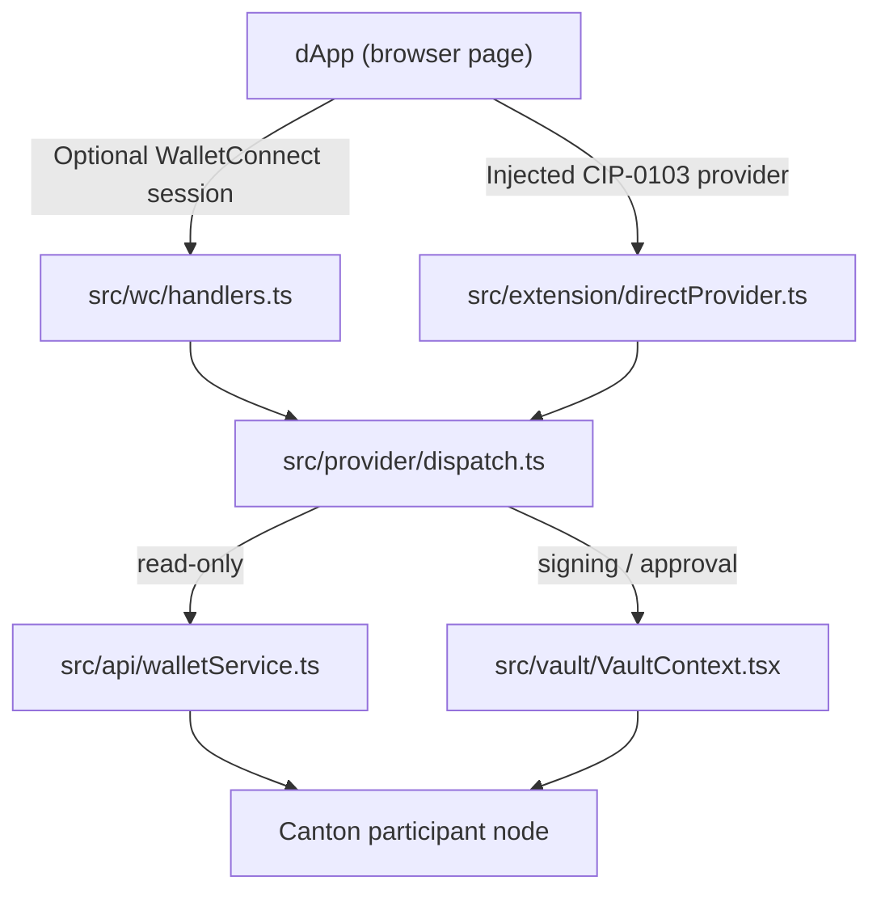

# Architecture Overview

<!-- Keep this document up to date as the system evolves. It captures structural
     knowledge that helps both humans onboarding and agents building context at
     session start. Focus on the "shape" of the system — not usage instructions
     (that's AGENTS.md) or API docs (that's code comments). -->

## Tech Stack

| Category | Technology | Notes |
|----------|-----------|-------|
| Framework | Vite 6 + React 18 | SPA; also builds as a Chrome extension |
| Language | TypeScript 5.9 (strict) | |
| Wallet protocol | Injected CIP-0103 provider + optional WalletConnect Sign Client 2.x | Browser extension provider events by default; Reown relay only for WalletConnect fallback |
| Cryptography | @noble/ed25519 3.x, @noble/hashes 1.x | Ed25519 signing; PBKDF2 + AES-GCM vault |
| UI primitives | React 18 + Radix UI | `@radix-ui/react-{dialog,tabs,toast,tooltip}` for modals/tabs/toasts/tooltips; local wrappers (Button family, TextInput, PasswordInput, Alert, Card, AccountAvatar, PendingActionCard, Sheet, Tabs, OptionList, Stepper, DangerConfirm, MenuRow, ToastProvider, Tooltip) for static visuals and Radix re-skins; shared icon SVG literals live in `src/components/ui/icons.tsx`; `Sheet` is the shared Radix Dialog scaffold for sheet-style flows (overlay, title, close button) and takes `side: 'bottom' | 'right'` (default `'bottom'`; right opens as a 400px-wide top-aligned drawer clamped by `100vw`); `ToastProvider` and `TooltipProvider` are both mounted once in `App.tsx`; `TextInput` and `PasswordInput` accept `error?: boolean` which applies a danger border, a persistent focus ring, and `aria-invalid`; `Button.tsx` exports `GHOST_BUTTON_CLASS` / `ICON_BUTTON_CLASS` for ad-hoc buttons (e.g. `PasswordInput`'s show/hide button) |
| Styling | Tailwind CSS v4 (`@tailwindcss/vite`) | Utility classes inline in JSX; `src/index.css` declares CSS-variable tokens on `:root` / `[data-theme="dark"]` and exposes them to Tailwind through `@theme inline`; `@layer base` holds global resets; Radix `data-[state=...]` and `data-[highlighted]` attrs drive interactive variants |
| Fonts | `@fontsource-variable/manrope`, `@fontsource-variable/jetbrains-mono` | Self-hosted variable fonts so the extension popup works offline. Manrope is the whole UI: `font-sans` (UI chrome, body, labels, buttons) and `font-display` (hero wordmarks, view headings, section markers — heavier weight for hierarchy). JetBrains Mono is `font-mono` (party IDs, hashes, RPC URLs, JSON payloads) |
| Theming | Light / dark / system selector in the drawer menu | `src/theme/ThemeProvider.tsx` owns a persisted `mode` (`light` \| `dark` \| `system`, default `system`), resolves `system` against `prefers-color-scheme` (re-resolving on media changes while in `system`), and writes the resolved `data-theme` on `<html>` after mount; the selector lives at Settings → Theme (`src/components/menu/ThemeMenu.tsx`) with no header toggle; the Tailwind `dark:` variant is rebound to `[data-theme='dark']` via `@custom-variant` |
| Testing | Node built-in `node:test` + `tsx` loader | React Testing Library + happy-dom for `.tsx` interaction tests; bootstrapped via `test/setup-dom.ts` |
| Runtime | Browser (Chrome extension popup or standalone web tab) | |

## Project Structure

```
src/
  api/              JSON-RPC client for the external wallet-service backend
  assets/           SVG assets (hero illustration)
  components/       Shared UI components (Logo, Header, WelcomeHero, AccountCard,
                    AccountRow, AccountListRow, AccountsDialog, CopyPartyIdButton,
                    ActivityList, HomeTabs, AssetsPanel, ConnectionFooter,
                    NewPasswordFields, CreateAccountForm, PasswordStrengthIndicator,
                    SecurityPanel, menu/* drawer, ui/* primitives).
                    ui/* wraps Radix headless primitives (Tabs on top of
                    @radix-ui/react-tabs; Sheet on top of @radix-ui/react-dialog)
                    and provides static visuals (Button, TextInput, PasswordInput,
                    Alert, Card, OptionList, Stepper, DangerConfirm, AccountAvatar,
                    PendingActionCard).
  theme/            ThemeProvider + ThemeContext + useTheme hook driving the
                    [data-theme] attribute on <html>
  config/           Runtime config persisted to localStorage (RPC URL, network)
  extension/        Chrome extension scripts: background, content script, provider injection
  provider/         CIP-0103 wallet provider — request dispatcher and method handlers
  vault/            Encrypted local vault: PBKDF2 key derivation, AES-GCM storage, React context
  views/            Top-level UI views (onboarding/* two-step wizard, Unlock, Home, ConnectionSettings)
  wc/               WalletConnect sign client setup and session event handlers
  App.tsx           Root component — selects the active view based on vault state
  main.tsx          Entry point — detects chrome-extension:// vs web runtime
public/
  manifest.json     Chrome extension manifest (consumed during extension build)
  icons/            Extension icons (16, 32, 48, 128 px)
test/               Node test runner suite (11 test files)
```

## Key Abstractions

### Toast feedback (`src/components/ui/toast.ts` + `ToastProvider.tsx`)

Transient system feedback — action results, async errors, network failures, copy confirmations — surfaces as toasts. Inline `Alert` stays reserved for in-form validation tied to specific inputs and for persistent contextual hints inside cards.

- **`toast.ts`** — Pure-TS module owning the active-entries array and a subscriber list. Exposes `toast.{info,success,warning,error,dismiss,clear}` and a `subscribeToasts(listener)` API. Caps the visible stack at 3 entries; older entries are evicted on overflow. No React import, so non-component callers (WalletConnect handlers in `src/wc/`, vault errors, extension bridge) can fire toasts directly.
- **`ToastProvider.tsx`** — Renders the active entries through `@radix-ui/react-toast`. `ToastProvider` is mounted once in `App.tsx` below `VaultProvider`. The viewport is fixed top-center, stacked newest-on-top. Variants reuse the same `text-*` / `bg-*-soft` / `border-*` tokens and left-border accent as `Alert`. Default durations: info / success 5 s, warning 8 s, error never auto-dismisses (manual close only); all variants always render a close button.

### Vault (`src/vault/`)

The vault is the security core of the wallet. It holds encrypted account secrets in `localStorage` and exposes a React context so views can read and mutate wallet state without ever touching the raw ciphertext.

- **`VaultContext.tsx`** — React context that owns all in-memory plaintext. Module-scope closures hide the decrypted vault and session password from browser DevTools.
- **`crypto.ts`** — Stateless encryption helpers: PBKDF2-HMAC-SHA256 (600 000 iterations) for key derivation; AES-256-GCM via `SubtleCrypto` for encryption/decryption.
- **`storage.ts`** — Two-step localStorage write (`KEY_VAULT_NEXT` then `KEY_VAULT`) for crash-safe rotation. On load, checks for an interrupted rotation and recovers automatically.
- **`keypair.ts`** — Ed25519 sign/verify wrappers around `@noble/ed25519`.
- **`sessionUnlock.ts`** — Caches the session password and the absolute auto-lock deadline (`lockAt`) in `sessionStorage` (or `chrome.storage.session` when running as an extension) so the vault can survive page reloads while still honouring the configured idle timeout.
- **`useVault.ts`** — The only way components should access vault state. Never read `localStorage` directly.
- **`passwordStrength.ts`** — Owns the `zxcvbn-ts` setup and exports `scorePassword(pw)`, `isPasswordAcceptable(pw)`, `isConfirmMismatch(pw, c)`, `isNewPasswordPairValid(pw, c)`, `usePasswordStrengthReady()`, `MIN_PASSWORD_LENGTH`, and `MIN_PASSWORD_SCORE`. The EN + common dictionaries load lazily via dynamic `import()` so the Unlock / Home bundles never pay for them; `usePasswordStrengthReady()` kicks off the load on mount and triggers a re-render once `scorePassword` is real. A small in-module cache deduplicates scoring across the indicator and the submit-gate. Every callsite that gates on password quality (Setup, Change Password, the live strength meter) must import from here so the gate is defined in one place.

### CIP-0103 Provider (`src/provider/`)

Implements the Canton wallet provider standard. Any dApp request (from WalletConnect or direct injection) is routed here.

- **`dispatch.ts`** — Central request router. Maps method names to handlers and returns a `DispatchResult` with status `handled`, `pending-approval`, or `error`.
- **`methods.ts`** — Canonical method name constants plus legacy `canton_*` aliases for backwards compatibility.
- **`walletService.ts`** — Forwards ledger-read methods (`ledgerApi`, `prepareExecute`, etc.) to the external wallet-service JSON-RPC endpoint.
- **`accounts.ts`** — Adapts internal `AccountPublic` records to the CIP-0103 wire format.

### WalletConnect Integration (`src/wc/`)

Manages the WalletConnect sign client lifecycle and session event handling.

- **`client.ts`** — Creates the Reown `Core` and `SignClient` instances. Declares the supported CIP-0103 methods and events used during session proposals.
- **`handlers.ts`** — Subscribes to `session_proposal` and `session_request` events. Forwards approved requests to `src/provider/dispatch.ts` and responds with the result or rejection.
- **`accounts.ts`** — Formats internal `AccountPublic` records into the `eip155`-style account strings WalletConnect expects.

### Chrome Extension Bridge (`src/extension/`)

Connects the extension popup UI to web pages and the extension background.

- **`background.ts`** — Persistent service worker. Maintains a queue of pending dApp requests, updates the action badge with the count, and caches a wallet snapshot for the popup. Also records the set of direct (injected-provider) dApp origins that have connected to `chrome.storage.session`, which the popup reads and watches via `storage.session.onChanged` to drive the footer's connection state.
- **`contentScript.ts`** — Injected into every matched page; announces Carpincho with `canton:announceProvider`, responds to `canton:requestProvider`, and bridges page `window.postMessage` requests to the extension runtime.
- **`directProvider.ts`** — Handles direct injected-provider requests inside the background worker when the cached wallet snapshot can answer without opening the popup; approval-required methods are queued for the popup.
- **`messages.ts`** — Shared message-type constants and type guards used by all three extension scripts.
- **`runtimeClient.ts`** — Popup-side client for sending requests to the background and receiving responses.
- **`directConnections.ts`** — Persists the set of direct injected-provider dApp origins that have completed a connect (and removes them on disconnect) in `chrome.storage.session`, with an in-memory fallback when not running as an extension, so the popup footer can show connection state for non-WalletConnect dApps.
- **`directConnectionState.ts`** — Pure helper that normalizes page URLs to stable http(s) origins and derives a remember/forget/none update from a provider request/response pair: remembers on a successful `connect` whose result reports `isConnected: true`, forgets on `disconnect`.
- **`walletSnapshot.ts`** — Serialises the current wallet state (accounts, network, lock status) into a plain object the background caches so the popup can render without unlocking the vault.

### Data Access Layer

The app communicates with two external systems:

| System | Module | Notes |
|--------|--------|-------|
| wallet-service JSON-RPC | `src/api/walletService.ts` | Wraps all RPC calls; URL comes from `src/config/runtimeConfig.ts` |
| Injected extension provider | `src/extension/contentScript.ts` | Announces Carpincho to dApps through `canton:requestProvider` / `canton:announceProvider` and relays provider requests through the extension runtime |
| WalletConnect relay | `src/wc/client.ts` | Optional fallback sign client connected to Reown relay using `VITE_WC_PROJECT_ID` |

Components must never call these systems directly. All wallet-service calls go through `src/provider/walletService.ts`; injected-provider requests are bridged by `src/extension/contentScript.ts` / `src/extension/background.ts`, and WalletConnect events are handled in `src/wc/handlers.ts`. Both paths forward to the provider dispatcher.

## Data Flow



State mutations (unlock, add account, sign) go through `VaultContext`. Network calls go through `src/api/walletService.ts`. The provider dispatcher never touches `localStorage` directly.

## Environment Variables

| Variable | Purpose |
|----------|---------|
| `VITE_WC_PROJECT_ID` | Optional WalletConnect / Reown project ID (from cloud.reown.com), only needed for the WalletConnect fallback |

Runtime-only configuration (RPC URL, Canton network name) is stored in `localStorage` via `src/config/runtimeConfig.ts` and is not an environment variable.

## Scripts

| Command | Purpose |
|---------|---------|
| `npm run dev` | Start dev server at `http://localhost:3011` (strict port) |
| `npm run build` | TypeScript check + Vite web build → `dist/` |
| `npm run build:extension` | TypeScript check + Vite extension build → `dist-extension/` |
| `npm test` | Run test suite with Node built-in test runner |
| `npm run lint` | Biome lint + format check across all files |
| `npm run lint:fix` | Biome lint + format check with auto-fix |
| `npm run format` | Biome format-only with auto-fix |
| `npm run preview` | Serve the production web build locally |

---

## Domain-Specific Sections

### Provider / Context Hierarchy

Two React contexts wrap the app. `ThemeProvider` is mounted outermost (in `src/main.tsx`) because theme state is independent of vault state and must apply even on Setup / Unlock screens. `VaultProvider` is mounted by `src/App.tsx`.

```
<ThemeProvider>           src/theme/ThemeProvider.tsx (mounted in src/main.tsx)
  <VaultProvider>         src/vault/VaultContext.tsx (mounted in src/App.tsx)
    <TooltipProvider>     src/components/ui/Tooltip.tsx (mounted in src/App.tsx)
      <ToastProvider>     src/components/ui/ToastProvider.tsx (mounted in src/App.tsx)
        <Shell>           src/App.tsx — reads vault state to pick the active view
          <Header />      includes the Menu burger button
          <HomeView />    or <OnboardingFlow />, <UnlockView />, etc.
          <MenuSheet />   drill-down drawer (Menu → Settings → Theme / Security & Password → Password / Auto-lock)
        </Shell>
      </ToastProvider>
    </TooltipProvider>
```

There is no router. `Shell` picks one view from `useVault()` via the pure `selectShellView` helper in `src/App.tsx`, branching on `hasVault`, `isLocked`, and `accounts.length`: no vault → `OnboardingFlow` (step 1, create vault); unlocked vault with no account yet → `OnboardingFlow` (step 2, create first account); locked vault → `UnlockView`; unlocked vault with at least one account → `HomeView`. While `useVault()` reports `isLoading`, `Shell` renders a centred spinner instead of any view so the session-restore decision lands in one paint and the Unlock screen never flashes.

The Menu drawer lives in `src/components/menu/`: `MenuSheet.tsx` is the navigation orchestrator (wraps the shared `Sheet` primitive with `side="right"`, opening as a 400px-wide top-aligned panel clamped by `100vw` that slides in via `animate-sheet-slide-right`), `screens.ts` holds the `Screen` union plus the `SCREENS` metadata map and the `MENU_LISTS` row data for the navigation-list screens, `MenuList.tsx` renders those rows, and `ThemeMenu.tsx` is the Theme leaf. It manages internal screen state (`root` → `settings` → `theme` | `security`; `security` → `password` | `auto-lock`); each in-drawer transition uses `animate-slide-in-right` (forward) or `animate-slide-in-left` (back). Navigation-list screens are data-driven via `MENU_LISTS`; leaf screens (`theme`, `password`, `auto-lock`) render a component. Every new option must be added as another `Screen` with an entry in the `SCREENS` map (`title`, `description`, `parent`); accordion-style expansion inside a screen is disallowed.

### Theming

- **Tokens** — `src/index.css` defines colour, radius, font, shadow, animation, and sizing tokens. Colours live as CSS custom properties on `:root` (light) and `[data-theme="dark"]` (dark); `@theme inline` re-exposes them to Tailwind so utilities like `bg-surface` / `text-muted-foreground` / `bg-scrim` flip automatically with the data attribute. Radius (`rounded-sm/md/lg/xl`), shadows (`shadow-card`, `shadow-popover`, `shadow-focus`, `shadow-glow`), the font families (`font-display` / `font-sans` both Manrope, `font-mono` JetBrains Mono), and named keyframes (`fade-in`, `slide-down-and-fade`, `slide-up-and-fade`, `sheet-up`, `sheet-slide-right`, `slide-in-right`, `slide-in-left`, `soft-pulse`, `drift`) are also tokens. Custom sizing utilities are declared via `@utility`: `w-popup` (popup viewport width, `min(100%, 430px)`), `w-drawer` (right-anchored drawer width), and `max-h-sheet` (bottom-sheet max height). The palette follows the dappbooster brand: a cool navy dark theme (`#14152b`) matching `dappbooster-canton-landing` and a neutral-grey light theme (`#f7f7f7`, primary `#692581`) matching the `dAppBooster` boilerplate, with a shared purple→pink brand accent (`--bg-gradient-brand: linear-gradient(135deg, #c670e5, #e71d73)` plus `--shadow-glow`) applied on primary-button hover and the hero wordmark. Green (`--color-success`) is the positive accent (used for the connected-state indicator) and `--color-scrim` is the theme-aware modal/sheet backdrop tint. A brand-tinted radial top-glow (`--bg-radial`) sits behind the page; there is no paper-grain overlay.
- **Theme provider** — `src/theme/ThemeProvider.tsx` owns a persisted `mode` (`light` | `dark` | `system`) stored in `localStorage.carpincho-theme`, defaulting to `system` when nothing is stored. It resolves `system` against `prefers-color-scheme`, re-resolves on media changes while in `system`, and writes the resolved `data-theme` on `<html>` after mount. Components consume it via the `useTheme()` hook (`src/theme/useTheme.ts`), which exposes `{ mode, setMode }`.
- **Selector** — `src/components/menu/ThemeMenu.tsx` is the Theme leaf inside the Menu drawer (Settings → Theme). It lists `Light` / `Dark` / `System` (System default) and marks the active mode with a checkmark; there is no header toggle.

### Auth / Session Management

Authentication is local-only; there is no remote auth service.

- **Setup** — user creates a password; `VaultContext.setup()` derives an AES key via PBKDF2 and writes the first encrypted vault to `localStorage`.
- **Unlock** — `VaultContext.unlock(password)` re-derives the key, decrypts the vault, and stores the plaintext in a module-scope closure. The password is cached in `sessionStorage` via `sessionUnlock.ts` so hot-reloads do not require re-entry.
- **Auto-lock** — Configurable from the Menu drawer (`Never` / `1 min` / `5 min` / `1 hour`, default `Never`, persisted to `localStorage.carpincho.autoLockOption`). Any timed option installs a `setTimeout`-based idle reset on window activity and also writes `Date.now() + idleMs` to `sessionStorage` as `carpincho.session.lockAt`. On mount, the session-restore effect refuses to auto-unlock if the persisted `lockAt` has elapsed, so the timeout is enforced across reloads, not just within a single tab session. On `pagehide` the in-memory vault is wiped when the active option is not `Never`.
- **Lock** — `VaultContext.lock()` clears the module-scope closure, the cached session password, and the `lockAt` deadline.

No JWT, cookie, or server-side session is involved.

### Extension Architecture

Two separate build artifacts are produced by `npm run build:extension`:

| Artifact | Entry | Role |
|----------|-------|------|
| Popup UI | `index.html` + `src/main.tsx` | The wallet's React UI, rendered in the extension popup |
| Content script | `src/extension/contentScript.ts` | Injected into every web page; relays `window.postMessage` ↔ extension runtime |
| Background script | `src/extension/background.ts` | Persistent service worker; queues requests, updates badge, caches wallet snapshot |

The popup and background communicate via `chrome.runtime.sendMessage` / `chrome.runtime.onMessage`. The content script and page communicate via `window.postMessage`. Message shapes are defined in `src/extension/messages.ts` and shared across all three scripts.

`src/main.tsx` detects `chrome-extension://` in `location.protocol` at startup and sets `document.documentElement.dataset.runtime = 'extension'`, which CSS can use for extension-specific layout adjustments.
